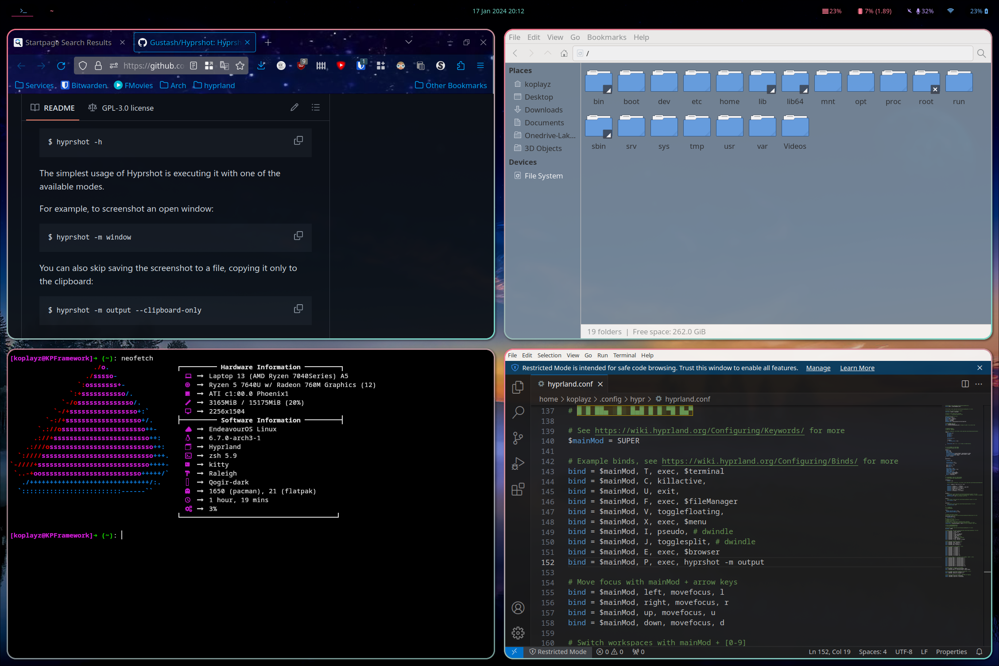
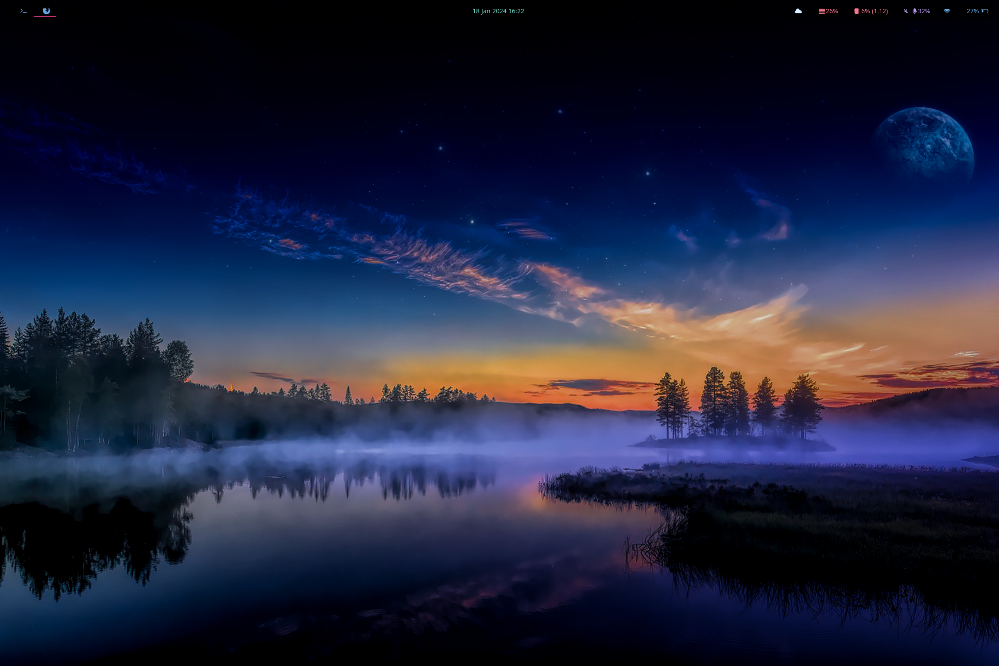
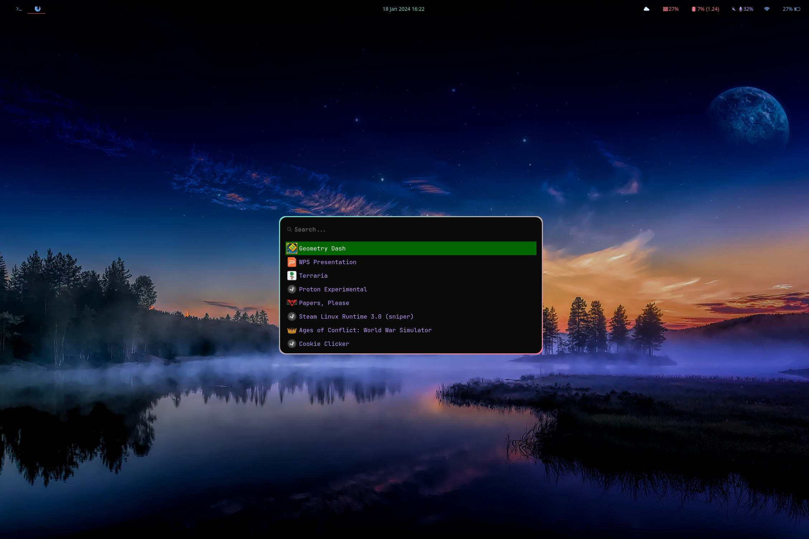

# Dotfiles

-   **OS** - EndeavourOS
-   **Window Manager/DE** - hyprland
-   **File Manager** - thunar
-   **Browser** - firefox /w custom user.js
-   **Terminal** - kitty
-   **Shell** - zsh
-   **Editor** - nano/VSCodium/
-   **Top Bar** - waybar
-   **Launcher** - wofi

## Background
