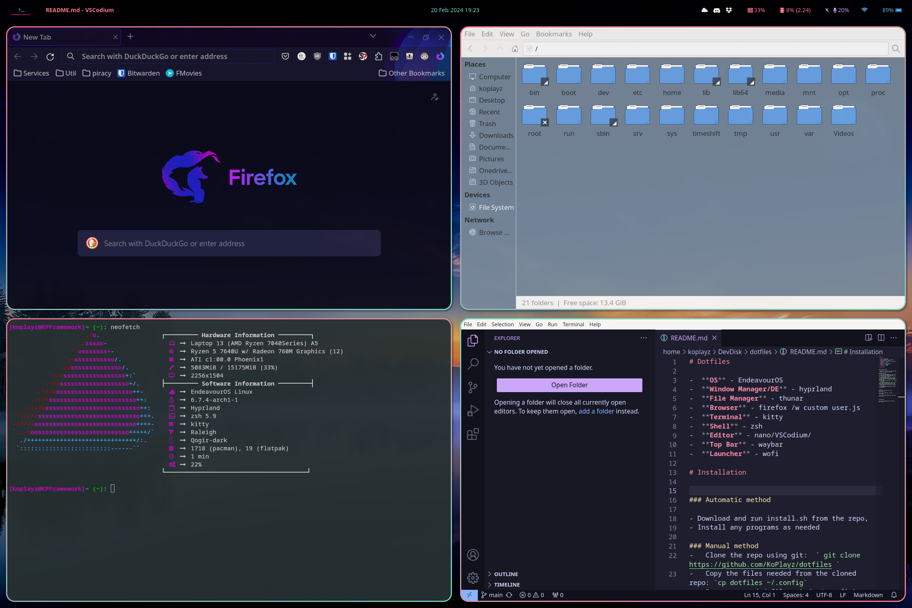

# Dotfiles

-  **OS** - EndeavourOS
-  **Window Manager/DE** - hyprland
-  **File Manager** - thunar
-  **Browser** - firefox /w custom user.js
-  **Terminal** - kitty
-  **Shell** - zsh
-  **Editor** - nano/VSCodium/
-  **Top Bar** - waybar
-  **Launcher** - wofi

# Installation

### Automatic method

- Download and run install.sh from the repo,
- Install any programs as needed

### Manual method
-	Clone the repo using git:  ` git clone https://github.com/KoPlayz/dotfiles `
-	Copy the files needed from the cloned repo: `cp dotfiles ~/.config`
-	Remove unneeded files: `cd ~/.config` `rm apps.png clean.png cleanlauncher.png copy.sh install.sh lastedited.txt README.md wallpaper.png`
-	(if needed) Copy old zshrc: `mv ~/.zshrc ~/.zshrc.bak`
-	(if needed) Install omz: `sh -c "$(curl -fsSL https://raw.githubusercontent.com/ohmyzsh/ohmyzsh/master/tools/install.sh)"`
-	Move zshrc to ~/.zshrc: `mv ~/.config/zshrc ~/.zshrc` 
-	(optional) Remove the dotfiles folder you downloaded

# Images

  

## Background

